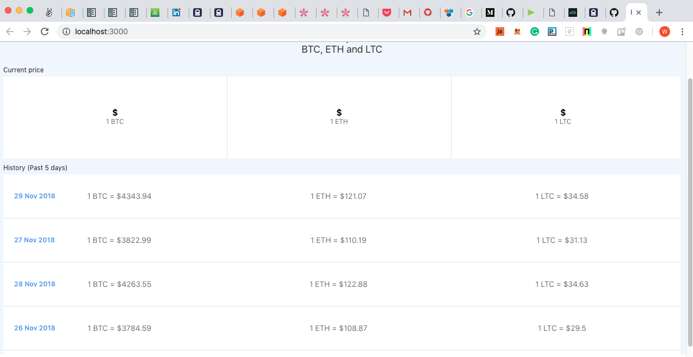
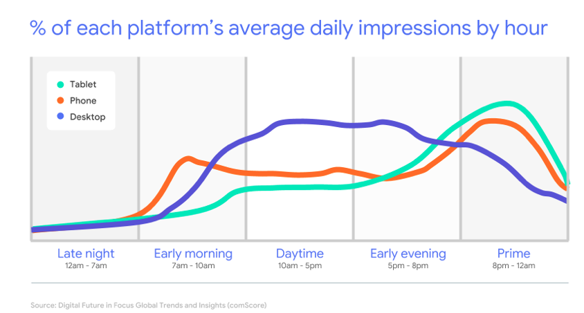

## Adsana Cryptocurrency Progressive Web App (PWA) test

PWA´s are the future of front end mobile application development.  

Read:  https://medium.com/@firt/progressive-web-apps-on-ios-are-here-d00430dee3a7

This Adsana Test PWA gathers and displays crypotocurrency price information in real time seemlessly.  

We built the front end of a React based Cryptocurrency Progressive Web App front end to test the speed, ease of use, deployment and file size of a PWA. 

This project was bootstrapped with [Create React App](https://github.com/facebook/create-react-app).

## Available Scripts

In the project directory, you can run:

### `npm start`

Runs the app in the development mode. 
Open [http://localhost:3000](http://localhost:3000) to view it in the browser.

The page will reload if you make edits. 
You will also see any lint errors in the console.

### `npm test`

Launches the test runner in the interactive watch mode. 
See the section about [running tests](https://facebook.github.io/create-react-app/docs/running-tests) for more information.

### `npm run build`

Builds the app for production to the `build` folder. 
It correctly bundles React in production mode and optimizes the build for the best performance.

The build is minified and the filenames include the hashes. 
Your app is ready to be deployed!

See the section about [deployment](https://facebook.github.io/create-react-app/docs/deployment) for more information.

### `npm run eject`

**Note: this is a one-way operation. Once you `eject`, you can’t go back!**

If you aren’t satisfied with the build tool and configuration choices, you can `eject` at any time. This command will remove the single build dependency from your project.

Instead, it will copy all the configuration files and the transitive dependencies (Webpack, Babel, ESLint, etc) right into your project so you have full control over them. All of the commands except `eject` will still work, but they will point to the copied scripts so you can tweak them. At this point you’re on your own.

You don’t have to ever use `eject`. The curated feature set is suitable for small and middle deployments, and you shouldn’t feel obligated to use this feature. However we understand that this tool wouldn’t be useful if you couldn’t customize it when you are ready for it.

## Learn More

You can learn more in the [Create React App documentation](https://facebook.github.io/create-react-app/docs/getting-started).

To learn React, check out the [React documentation](https://reactjs.org/).

## Why Progressive web apps?

Progressive Web Apps are experiences that combine the best of the web and the best of apps. They use service workers, HTTPS, a manifest file and an app shell architecture to deliver native app experiences to web applications.
Key features of PWA:

## Multi-Platform: Independent of individual devices and operating systems.

## No download. No installation. No updates.

## Lightning fast.

## Clever enough to work offline.

## On average, less than 1% of the size of native apps.

Progressive Web Applications are a blessing for growth markets like India, China and Africa, where most users can only avail of poor network coverage and lower quality hardware. India, for example has 20% of all mobile phone users worldwide. 
However, 99% of the network cover,age in India is still based on 3G.

Early adopters like Trivago, Alibaba, Twitter, Tinder, Pinterest and Forbes are already enjoying remarkable success with PWA, achieving significantly higher user-engagement, better conversion rates and longer usage times. PWA beat native apps in all disciplines.

Benefits of PWAs

## Responsive

Progressive Web Apps are highly responsive. They auto adjusts the layout according to the device. So, whether it be a mobile, tablet, laptop or desktop, PWAs will fit any device.

## Secure

PWAs are more secure compared to traditional web apps because they are always served via HTTPS. This ensures that the app can is tamper proof and cannot be vandalized.

## Reliable Despite Network Flaws

One can rely on Progressive Web Apps even when the network is shoddy as it can even work offline. This is possible through service worker, a type of web worker. Konga, a leading e-commerce website in Nigeria managed to reduce 92% of the user data usage due to its Progressive Web App.

## Looks and Feels Just Like a Native App

The user won’t notice any difference between PWA and the native app. It exactly looks and feels like a native app and even provides similar features like push notification, integration with the system, display icon on the home screen and app drawer, etc.

## Installation

Making the user install your app from the store can be a pain in the neck. But with a PWA the user can install the app with just one tap. This frictionless installation lets users enjoy service instead of installing the bulky native app.

##  Easy Updates

One of the most amazing features of PWA is that it is easy to update. Since there is no app store that works as a mediator, your users can enjoy the updated app as soon as you have updated it from your side.

## Lightweight

Even though PWAs are packed with amazing features, they are extremely lightweight. Comparing Pinterest’s PWA with its Android and iOS app, it is just 150KB against 9.6MB and 56MB respectively. Charmingly lightweight, isn’t it?

## Visibility

Increase your business' visibility by your app's presence in search engine results. Optimize your SEO and take advantage of a level of discoverability far from what the stores can offer.

## Free download

Progressive Web Apps don't need to be installed to be visited, which therefore allows you to make your content easily accessible and eliminate the constraint of having to install the app, as in the case of native apps.

## App First

Initially thought out for mobile, Progressive Web Apps offer a perfect user experience, by bringing mobile development codes to all other types of screens.

## Multi-platform

Progressive Web Apps are multi-platform. They adapt perfectly to any screen they're used on mobile, tablet, or desktop. They are just as good in terms of design as they are in features.

## Progressive Web Apps boost mobile engagement

Progressive Web Apps claim, on average, 3 times more visitors than native apps, as well as sessions that are 8 times longer than those of classic websites. Arguments that constitute an essential tool for your business, one that attracts new visitors just as well as it engages your existing community.

## Instantaneous installation

Progressive Web Apps can be instantaneously installed directly on your users' home screens, without them having to download anything or go through the App stores. Their incomparable lightness also eliminates any memory constraints a device may have at the time of installation.

## Groundbreaking Changes

The idea of PWA sounds fascinating, but has it added any value to the businesses?

Well, the answer is yes. PWAs have proven successful in elevating performance, reach and user engagement. Here are some instances and case studies by Google.

Twitter has adopted PWA technology to improve the mobile engagement and reduce the data usage of its users. The social media giant has 328 million monthly active users all around the globe, among which 80% are mobile users.

They wanted to serve faster service, lower data consumption, provide robust, reliable and more engaging experience to the users and thus developed Twitter Lite Progressive Web App.

This year, Morneau spoke on Progressive Web Apps, which allow a web application on a smartphone to deliver a user experience that’s much more like a native app, but without the download barrier that limits native app adoption. “People prefer using apps on their phone rather than web apps on the browser,” he says. “And a home screen icon just makes the app more accessible, it works when it’s offline, and it can also push notifications out to users.”

Morneau used Oracle APEX to build and show an app that runs in a browser and will also install on his Android phone. Progressive Web Apps open up a lot of possibilities for developers “because we’re not just building Web apps anymore,” he says. “We’re building apps” that are no longer differentiated from native mobile apps.

Mobile has driven a lot of the evolution of Progressive Web Apps. But while the growth of mobile has been so strong, desktop usage is still growing. Mobile phone use peaks in the morning and evening, and tablet also has significantly higher use in the evening. Desktop usage is more evenly distributed throughout the day than mobile usage. It has significant use during the day when most people are at work and at their desks.

 

Having that ‘installed’, native feel, is important to users, it gives them the confidence that the app will be fast, integrated, reliable and engaging. Desktop Progressive Web Apps can be launched from the same place as other desktop apps, but that they run in an app window - so they look and feel like other apps on the desktop.
